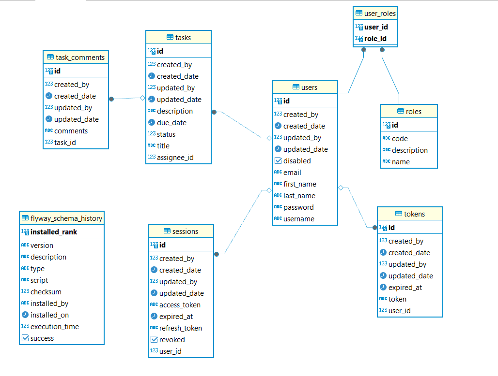

# Task Management Service

### Introduction

The Task Management Service is designed to help manage tasks efficiently with robust authentication and authorization mechanisms, user management, and comprehensive task handling features.

### Prerequisites

- Java 17+
- PostgreSQL
- Maven

### Installation

1. Clone the repository:

   ```bash
   git clone https://github.com/rizwanilyas/task-management.git
   ```

1. Navigate to the project directory:

   ```
   cd task-management
   ```

2. Configure the database connection in `src/main/resources/application.yml`.

3. Run the application:

   ```
   mvn spring-boot:run
   ```

### Usage

After running the application, it will be accessible at `http://localhost:8080`.

### Features

1. Authentication & Authorization
    - Secure access control for users.
2. User Management
    - Authentication Operations:
        - Login
        - Signup
        - Forget Password (via email)
        - Reset Password
        - Update Password
    - User Administration:
        - Activate/Deactivate Users
        - List Users with Search and Pagination
        - Update User Details
        - Send Reset Password Link (via email)
3. Task Management
    - Create Tasks
    - Update Tasks
    - Update Task Status (`completed`, `started`, `todo`)
    - Search Tasks by Status, Title, Date Range (with Pagination)
    - Delete Tasks
    - Add Comments to Tasks
    - Update Task Comments
    - Delete Task Comments

### User Roles

- Admin
    - Full access to all operations
- Regular
    - Restricted access

### Tools & Libraries Used

- **Implementation**: Java
- **Database**: PostgreSQL
- **Database Migration**: Flyway
- Frameworks & Libraries
    - Lombok
    - Spring Security
    - Spring Validation
    - Spring Web

### API Documentation

Swagger documentation is available for the Task Management Service. To access it, navigate to:

http://localhost:8080/swagger-ui.html


### ERD Diagram
